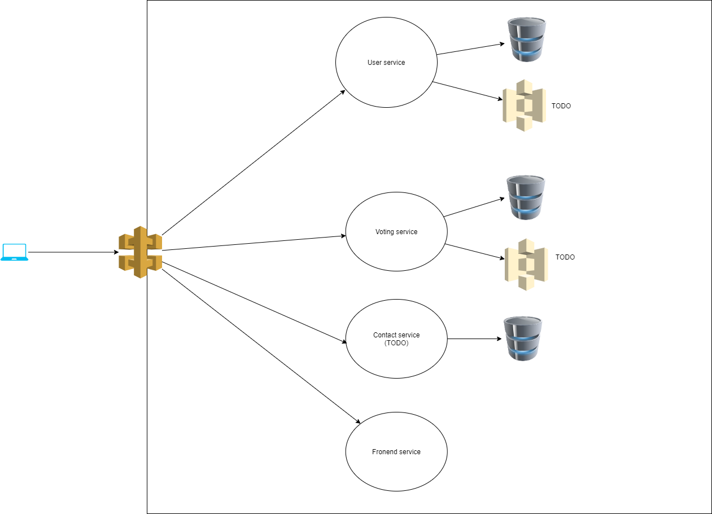

Table of Contents
=================
   * [Voting Microservices App](#voting-microservices-app)
   * [Technologies and concepts used](#technologies-and-concepts-used)
   * [Project Architecture Diagram](#project-architecture-diagram)
   * [File Structure](#file-structure)   
   * [How to Setup Project on Kubernetes Cluster in AWS EKS](#How-to-Setup-Project-on-Kubernetes-Cluster-in-AWS-EKS)   
   * [What to do](#what-to-do)

# Voting Microservices App
This project aims to enable users to vote for the topics created through the application.

### The project is split into four parts:
1. Frontend - React
2. Backend RESTful USER API - Node-Express application
3. Backend RESTful FEED API - Node-Express application
4. Reverse Proxy - Nginx

### Technologies and concepts used:
1. Elastic Kubernetes Service (EKS) as Kubernetes Manager
2. Kubernetes as Container Orchestrator and CD
3. Travis as CI Tool
4. AWS NoSQL DB - DynamoDB
5. AWS RDS - PostgreSQL
6. Docker and Dockerhub
7. Nginx as Reverse Proxy/Load Balancer 
8. React and Express Frameworks 

### Project Architecture Diagram


#### File Structure
```
root  
│
└───K8s: All deployment and service files
│   
└───assets: README.md stuffs
│   
└───services
│   │   
│   └───feed-service: which is used to serve feeds
│   └───frontend-service: which is used to serve react app
│   └───reverseproxy-service: load balancer
│   └───user-service: which is used to manage sign in/out and authentication
```

## How to Setup Project on Kubernetes Cluster in AWS EKS
1. Create a cluster and node group in EKS
2. install kubectl, Set up aws-iam-authenticator and kubeconfig
3. Update cluster config at your local env.
4. Apply secret files required
5. Apply K8s deployment and service files
6. To check final end point which is exposed: type 'kubectl get services' and copy the end point of reverse proxy service

# What to do
- Allowing the user to delete and update feeds
- Allowing the user to vote(like/dislike) a feed or its comment
- Enable the user to write only one comment per feed
- Enable the user to add a profile photo and some other information about himself
- Check email and ip address to prevent multiple voting on same feed
- Allowing the user to share link of feed to make possible interaction of other people with feed
- Pagination
- Building a forgot password logic
- Add self healing end points